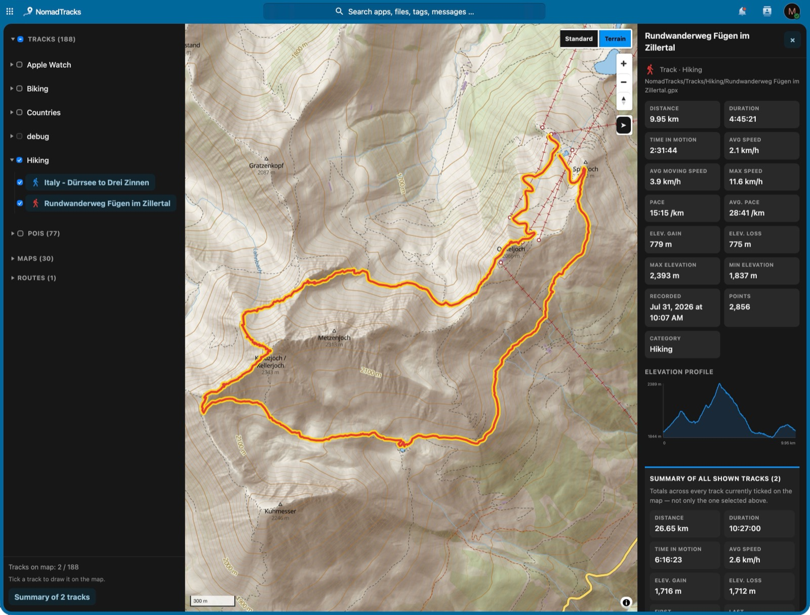

# NomadTracks for Nextcloud

Shows the library that the NomadTracks mobile app syncs into the
`NomadTracks/` folder of your Nextcloud files on a map.

NomadTracks for
[iOS](https://apps.apple.com/app/id6764303399) ·
[Android](https://play.google.com/store/apps/details?id=com.mcw.nomadtracks)



## What it does

- Folder tree of your synced tracks, POIs, routes and custom maps;
  tick what you want on the map. Colours and category icons are the
  app's own.
- Details for the selected track, POI or route, including an elevation
  profile. Elevation gain and loss use a port of the app's own filter,
  so the numbers match the app.
- The shown/hidden selection is saved per user; map type, direction
  arrows, sidebar width and folder state are remembered per browser.
- A summary over all shown tracks, with add-ons for special purposes
  (currently: export as Austrian practice-driving logbook).
- "Open in NomadTracks" for GPX files in the Files app.

Read-only: the app never writes to the synced files. Everything is
read in the browser through Nextcloud's own WebDAV endpoint — no
server-side parsing, no extra database.

## Requirements

- Nextcloud 28 – 34.
- A library synced by the NomadTracks app into `NomadTracks/` at the
  root of the user's files.

## Install

Plain PHP + JS, no build step. MapLibre GL JS is vendored because
Nextcloud's Content-Security-Policy blocks CDNs.

```sh
cd /path/to/nextcloud/apps
git clone https://github.com/DonkeyCat-GmbH/nomadtracks-nextcloud_plugin.git nomadtracks
sudo -u www-data php occ app:enable nomadtracks
```

The directory name must be `nomadtracks` (the app id).

## Add-ons

Special-purpose tools live in `js/addons/` and register with
`NomadTracks.addons` (contract in `js/addons.js`). To add one: create
`js/addons/<id>.js` and load it from `PageController` after `addons`
and before `main`.

## File formats read

Defined by NomadTracks sync schema v1.

| File | Format | Used for |
|---|---|---|
| `Tracks/**/*.gpx` | GPX 1.1 | track line, altitude / time / heart rate, name, notes |
| `POIs/**/*.geojson` | single-Feature GeoJSON | POI markers and properties |
| `**/*.nomadmeta.json` | JSON sidecar | rating, colour, category, photo count, address |
| `Routes/**/*.nomadroute` | `NMDRTE01` package (embedded GPX) | route line + stops |
| `Maps/**/*.nomadmap` | `NMDMAP01` package | listed only |

## Release

`./build-release.sh` builds `build/nomadtracks-<version>.tar.gz` for the
App Store and prints the signing command.

## Tests

```sh
node tests/elevation-smoke.js
```

## License

AGPL-3.0-or-later. Vendored MapLibre GL JS is BSD-3-Clause
(`js/vendor/maplibre-gl/LICENSE.txt`).
